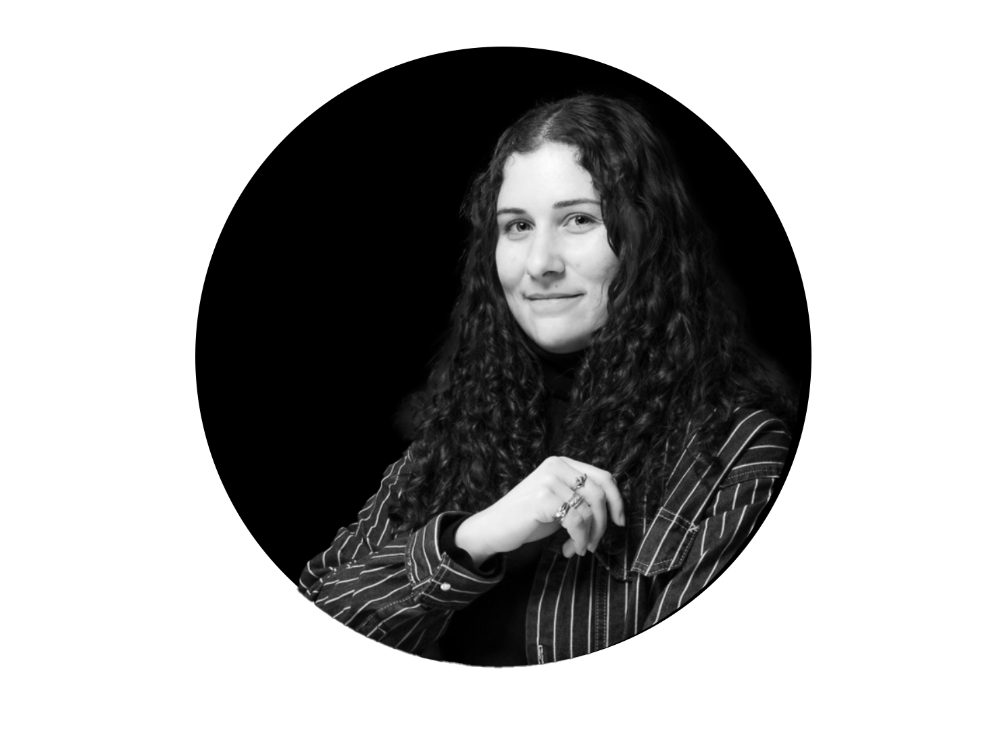
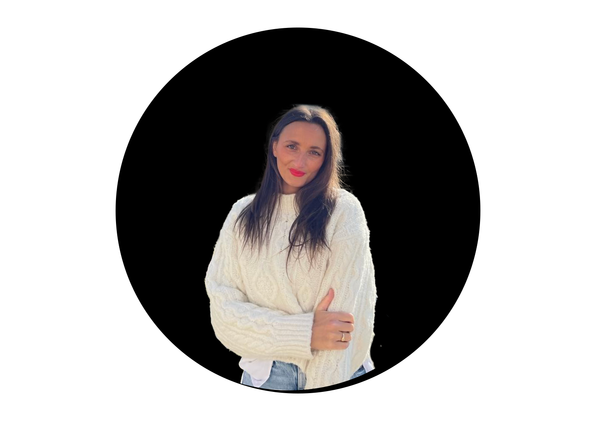

Enchantée, je suis Cassandra, une étudiante dynamique en Bachelor de communication. Passionnée par le pouvoir des mots et des médias, je me lance dans ce projet d'école avec enthousiasme, car il me permet d'explorer et de perfectionner mes compétences dans le domaine de la communication. Chaque jour, je découvre de nouvelles facettes fascinantes de ce monde en constante évolution.

Ce blog est le fruit d'un projet d'année passionnant où nous avons eu l'opportunité deplonger au cœur des différents métiers de la communication. Mon choix s'est naturellement porté vers le rôle de chef de projet événementiel, un domaine qui m'attire particulièrement. Travailler sur ce projet m'a permis de découvrir l'envers du décor, les défis et les subtilités de ce secteur fascinant. Chaque étape a été une véritable leçon, me permettant d'acquérir une précieuse expérience et de mieux comprendre les rouages de cette profession dynamique.

            

                
                <h4>Aucante Lucie</h4>
                
Chef de projet événementiel

            

            

                
                <h4>Dabre Nicolas</h4>
                
Chef de projet animation JO 2024

            

            

                
                <h4>Maynard Julien</h4>
                
Responsable communication au PSG

            

            

                
                <h4>Mocquet Lola</h4>
                
Chargée de projet JO 2024

            

            

                
                <h4>Tillandsia Gil</h4>
                
Chef de projet événementiel JO 2024

            

        

 

                                            
Je suis profondément reconnaissante envers les professionnels  que j'ai interviewés pour mon projet d'étude. Leur générosité, leur ouverture d'esprit et leurs conseils ont été précieux pour approfondir ma compréhension du sujet. Leur contribution a été essentielle à la réussite de mon projet académique. Un grand merci à eux pour leur temps et leur coopération.